# Automated terminal emulator benchmarks

This is a collection of scripts using [vtebench] to automatically collect
terminal emulator performance data.

[vtebench]: https://github.com/alacritty/vtebench

## Results

The results for all historical benchmarks can be found in the `./results`
directory. The last 10 runs of the latest Alacritty master are automatically
plotted:

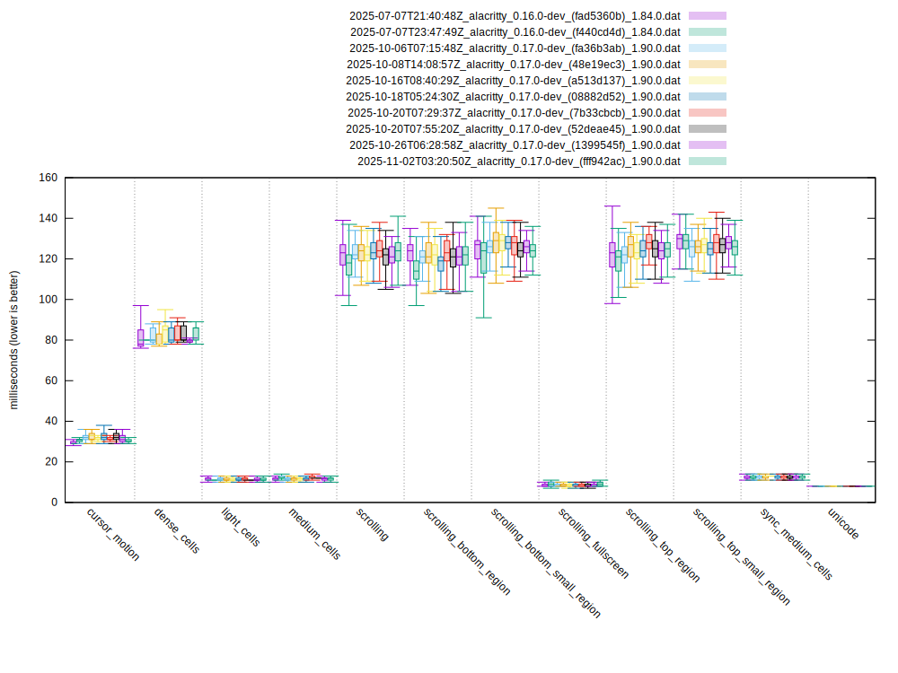
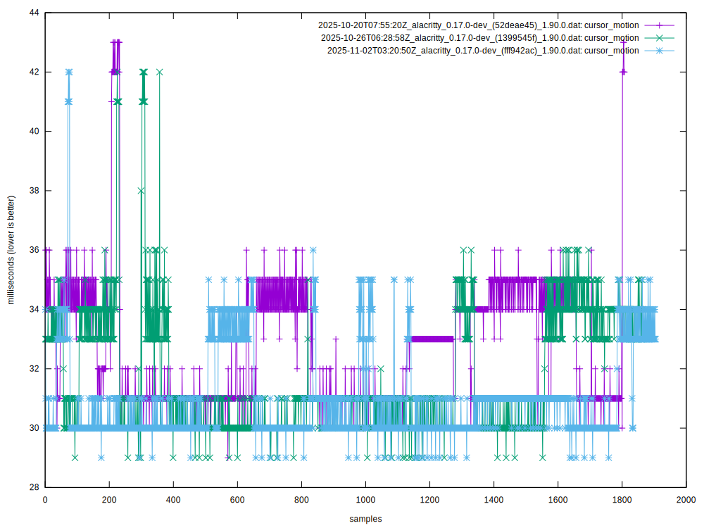
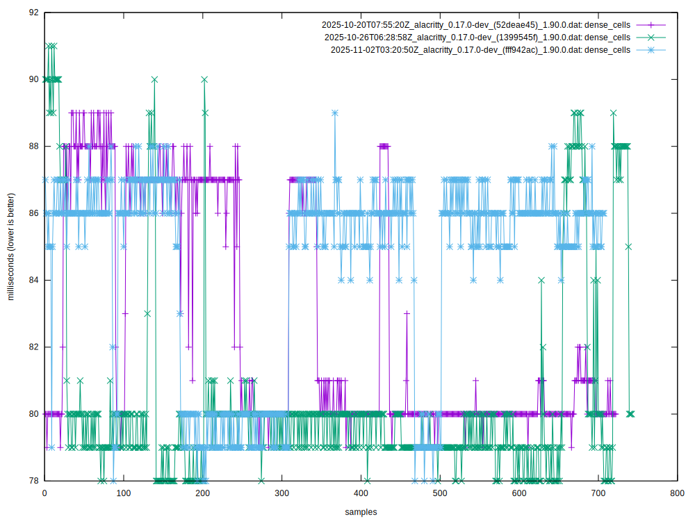
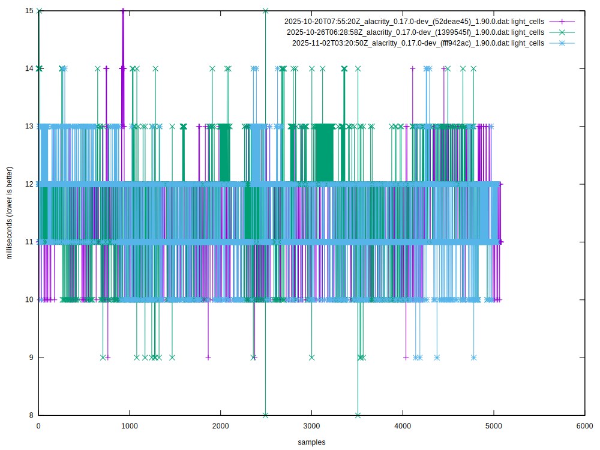
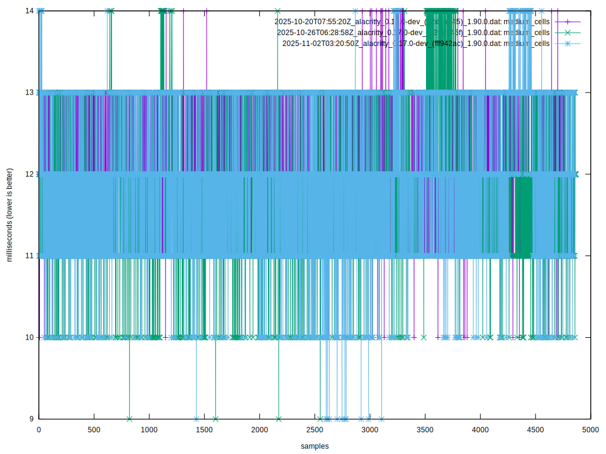
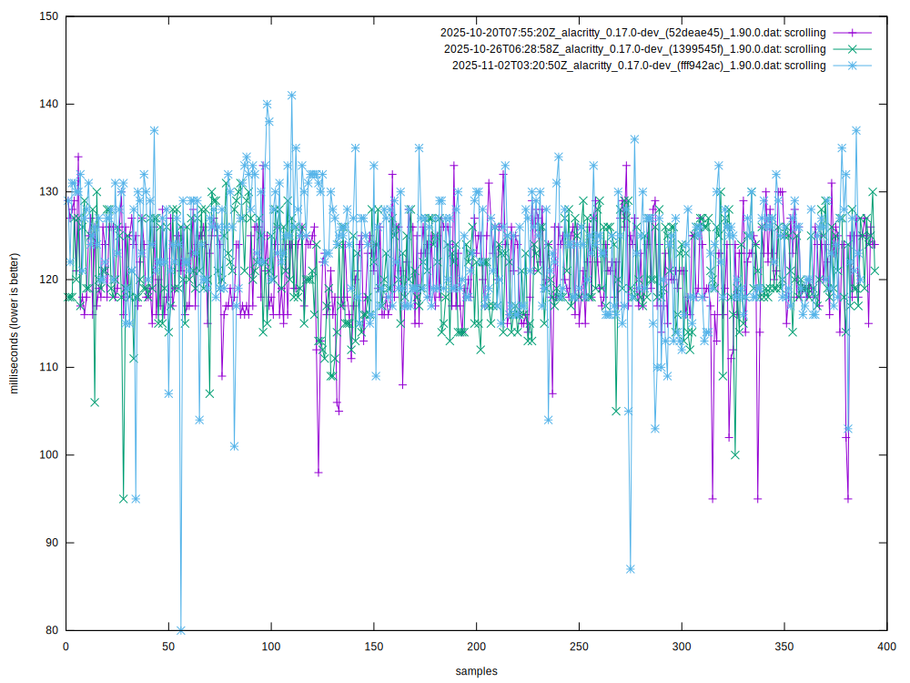
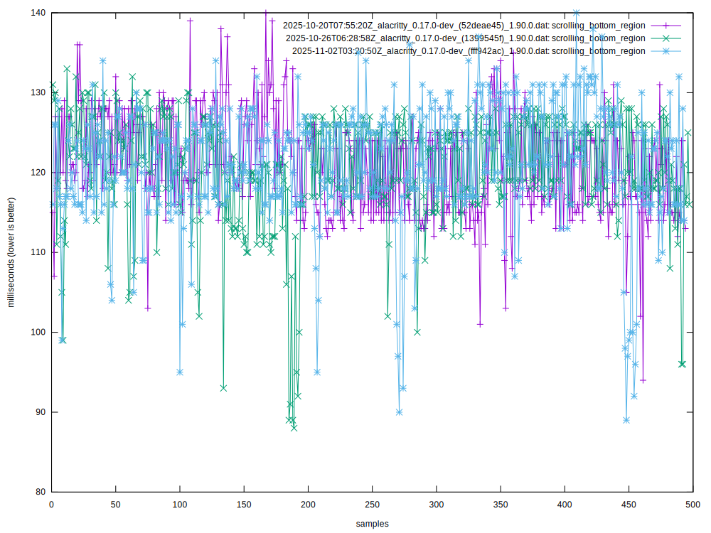
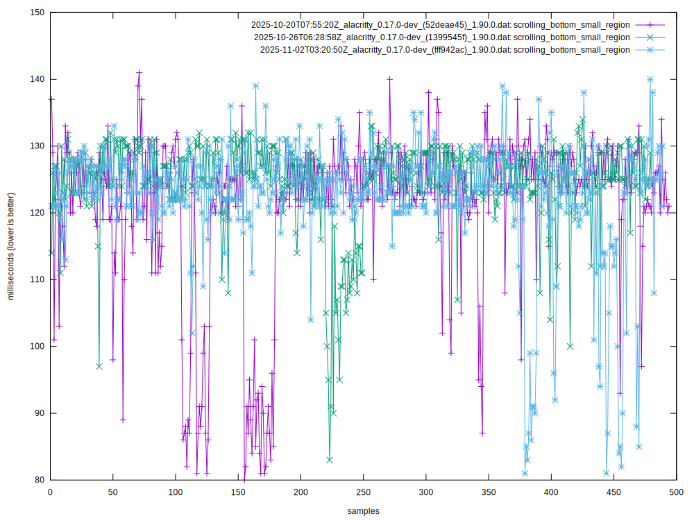
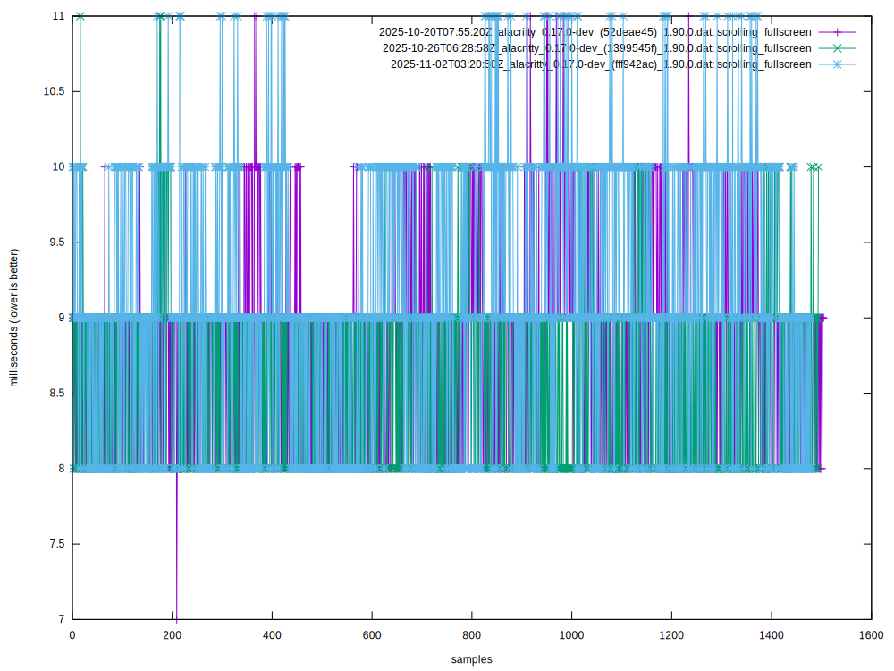
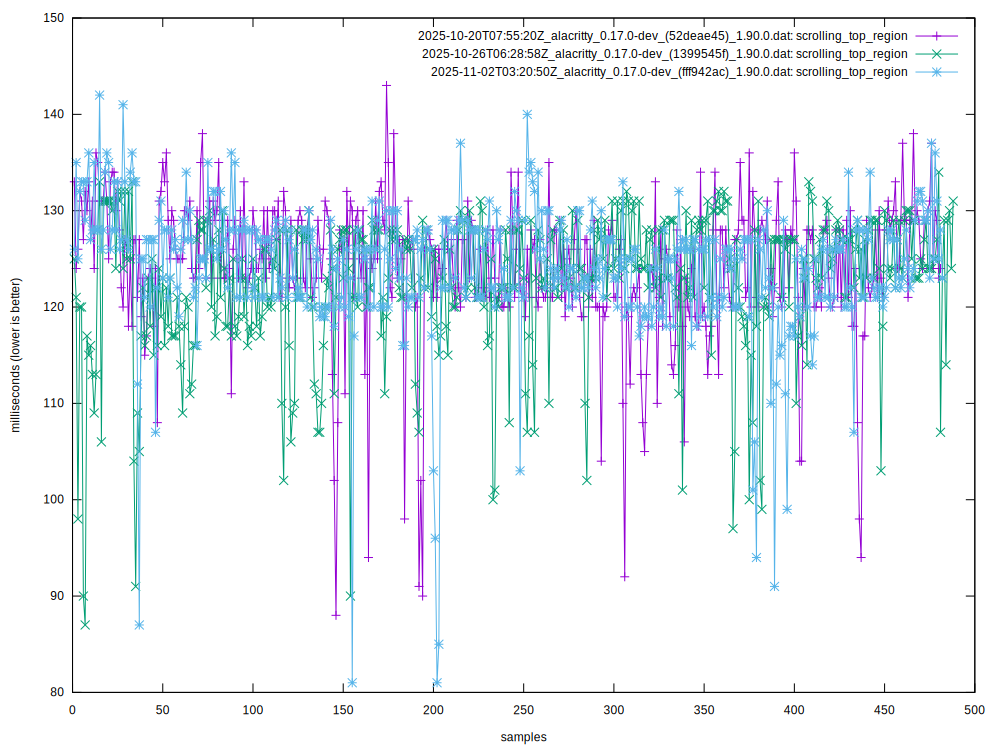
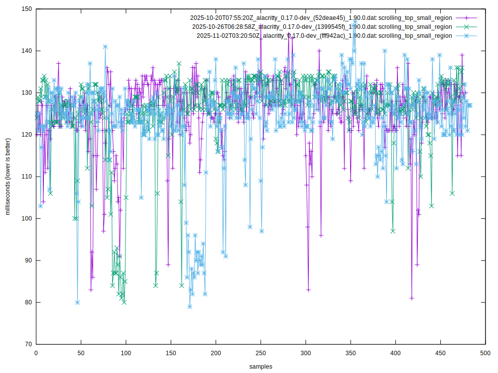
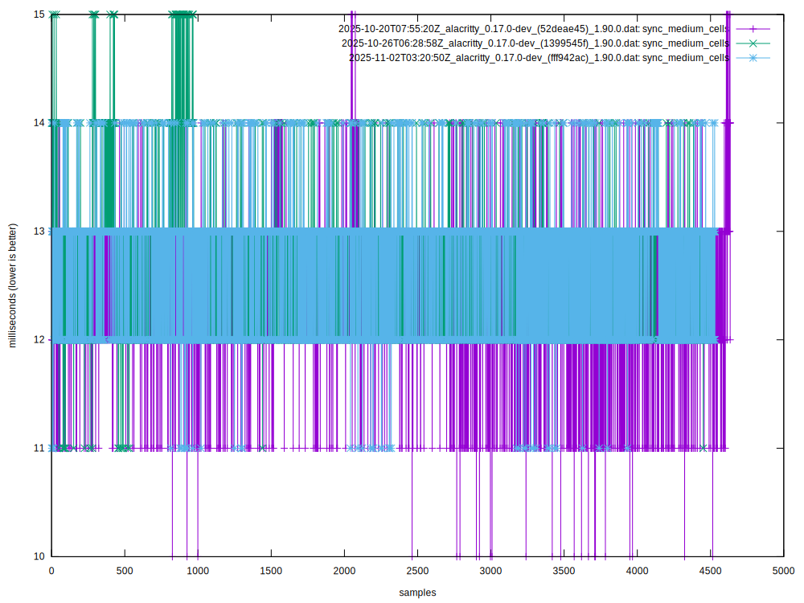

## Setup

To get consistent and meaningful results, the `./config` directory contains the
configuration files for all supported terminal emulators.

The `alacritty_master.sh` and `bench.sh` scripts are the primary executables for
benchmarking. The `bench.sh` can be used to run any terminal emulator, while
`alacritty_master.sh` uses it to run the latest Alacritty master. Both must be
run as `root` to allow `xinit` to start the X Server and use the `perfbot` user
to execute everything that does not require root permission.

The `alacritty_master` service and timer in the `./systemd` repository is
responsible for running the `alacritty_master.sh` script every day.

The following dependencies are required:
 - X Server and xinit
 - gnuplot
 - cargo
 - git
